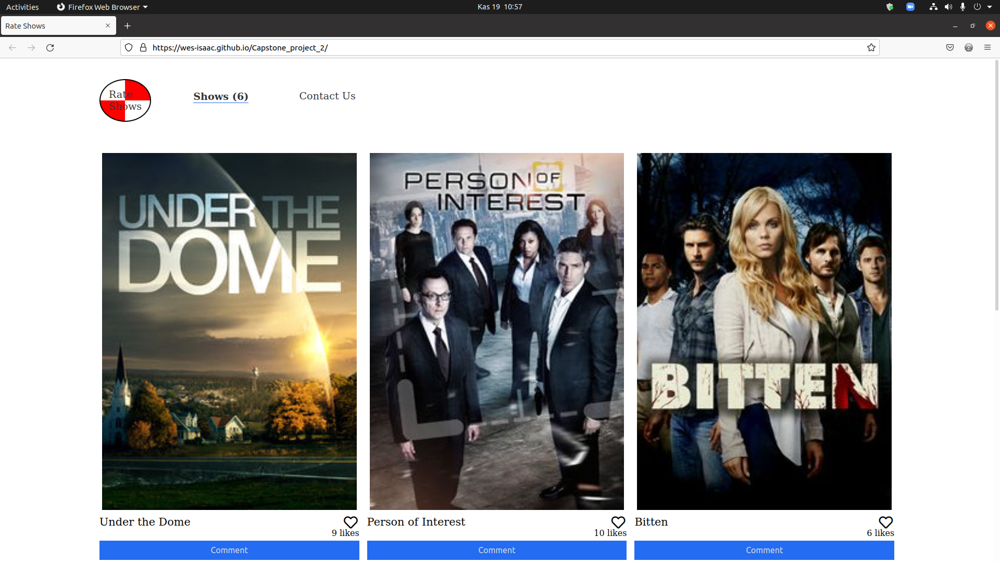

# Shows

> The project that made with API calls by using Webpack.




## Built With

- HTML&CSS, JavaScript
- Webpack, Jest, Involment API, TVMaze API
- Kanban

## Live Demo

[Live Demo Link](https://livedemo.com)


## Getting Started

### Prerequisites

> Git

> npm

> Web Browser

> Code Editor

### Setup

To get a local copy up and running follow these simple example steps.

Clone the project:

```
git clone https://github.com/Wes-Isaac/Capstone_project_2.git
```

cd into the file:

```
cd Capstone_project_2.git
```

Open with any code editor

### Install

Instal node modules:

```
npm install
```

Initialize local server:

```
npm start
```

### Usage

You can see the given shows and like them. In the comment sections for the shows, you can see more information and comments. If you have any remarks for the show, don't forget to add your precious opinions on them.

### Run tests

Use following command for tests

```
npm test
```


## Authors

👤 **Yishak**

- GitHub: [Yishak ,Wes-Isaac](https://github.com/Wes-Isaac)
- LinkedIn: [@Yishak](https://www.linkedin.com/in/yishak-wesego-b404851a7/)

👤 **Orçun**

- GitHub: [@githubhandle](https://github.com/luftedar)
- Twitter: [@twitterhandle](https://twitter.com/OrcunUgur2)
- LinkedIn: [LinkedIn](https://www.linkedin.com/in/or%C3%A7un-u%C4%9Fur-089148181/)

## 🤝 Contributing

Contributions, issues, and feature requests are welcome!

Feel free to check the [issues page](../../issues/).

## Show your support

Give a ⭐️ if you like this project!

## Acknowledgments

- This project is built in Microverse's second module's capstone.

## 📝 License

This project is [MIT](./MIT.md) licensed.
